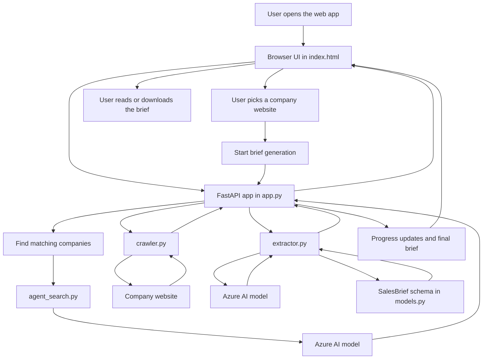
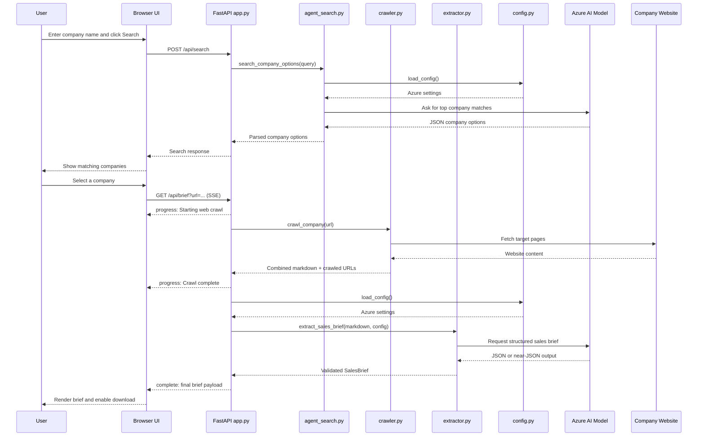
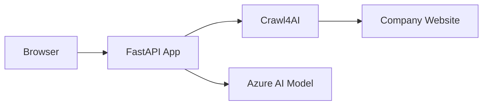

# Sales Intelligence Pipeline Architecture

## What This App Does

This app helps a sales or presales user go from a company name to a usable sales brief.

The user types in a company name, the app finds likely matching companies, the user picks the right one, the app reads important pages from that company's website, and AI turns that content into a structured summary.

In short, the app answers one question:

"Can we quickly understand this company before the first meeting?"

## Big Picture

## Main User Journey

### Step 1: Open the app

The user opens the web page.

The backend serves a single HTML page from `templates/index.html`. That page contains the interface, styling, and browser-side logic.

### Step 2: Search for a company

The user types a company name and clicks Search.

The browser sends a request to `/api/search`.

The backend uses AI to suggest up to three likely company matches, including the official website URL and a short description.

This helps the user avoid crawling the wrong website.

### Step 3: Choose the right company

The user selects one of the returned companies.

At that point, the app starts the brief-generation process.

### Step 4: Crawl the company website

The app visits a set of useful pages on the selected website, such as:

- home page
- about page
- products or services pages
- careers page
- news or press pages

The crawler converts the website content into cleaner Markdown text so it is easier for AI to analyze.

### Step 5: Generate the sales brief

The cleaned website content is sent to Azure-hosted AI.

The AI is instructed to return a structured brief with sections such as:

- what the company does
- industry
- recent news
- key people
- technology mentions
- talking points
- discovery questions
- Azure relevance

The app validates the AI response against a defined schema before returning it.

### Step 6: Show the result

While the work is running, the browser receives progress updates.

When the brief is ready, the UI renders it on screen and also allows the user to download it as a Markdown file.

## Exact Request Lifecycle

This diagram shows the real sequence used by the browser and backend for both `/api/search` and `/api/brief`.

## Why The Design Is Simple

This project keeps the design intentionally small.

- One backend service handles everything.
- One frontend file handles the whole browser experience.
- There is no database.
- There is no background job system.
- There is no user login system.

That makes the app easier to understand, demo, and deploy.

## Main Parts of the System

### Frontend

The frontend lives in `templates/index.html`.

It does four jobs:

- collects the company name from the user
- shows the company options returned by AI
- listens for progress updates while the brief is being built
- renders the final brief and supports Markdown download

### Backend API

The backend lives in `app.py`.

It is the main traffic controller for the app.

It exposes these routes:

- `/` to load the web page
- `/api/search` to find company options
- `/api/brief` to generate and stream the brief

### Search Logic

`agent_search.py` is responsible for turning a company name into a short list of likely website matches.

This is important because the rest of the pipeline depends on choosing the correct company website.

### Crawling Logic

`crawler.py` is responsible for reading the selected website.

It does not try to crawl the whole internet or every possible page. It focuses on a curated list of paths that usually contain useful business information.

### Extraction Logic

`extractor.py` is responsible for turning website content into a structured sales brief.

It sends the cleaned content to Azure AI, asks for a JSON response, and validates that response.

If the AI returns malformed JSON the first time, the extractor retries once with stricter instructions.

### Schema Definition

`models.py` defines the expected shape of the final output.

This gives the app a consistent brief format and reduces the chance of returning random or incomplete AI output.

### Configuration

`config.py` loads the Azure settings from environment variables.

This keeps secrets and deployment settings outside the main application logic.

## Purpose Of Each File

| File | Purpose |
| --- | --- |
| `app.py` | Main application entry point. Serves the UI and handles the API routes. |
| `agent_search.py` | Uses AI to find likely company matches and official websites. |
| `crawler.py` | Crawls selected website pages and converts them into clean markdown. |
| `extractor.py` | Sends crawled content to Azure AI and builds the final structured brief. |
| `models.py` | Defines the fields expected in the sales brief. |
| `config.py` | Loads environment variables for Azure access. |
| `templates/index.html` | Complete frontend page with UI, styles, JavaScript logic, and download feature. |
| `requirements.txt` | Python package list for installation. |
| `README.md` | Project overview and setup instructions. |
| `crawl_test.py` | Demo script for testing Crawl4AI behavior on a webpage. |
| `test.py` | Very small smoke test that checks Crawl4AI import. |
| `Dockerfile` | Container setup for running the app in a production-style environment. |
| `.dockerignore` | Excludes unnecessary files from Docker builds. |
| `.gitignore` | Excludes local files, secrets, and caches from git. |
| `.env.example` | Shows which Azure environment variables must be provided. |
| `pyproject.toml` | Standard Python project metadata and dependency definition. |

## External Services Used

## Environment Variables

The app expects these values in `.env`:

- `AZURE_FOUNDRY_API_KEY`
- `AZURE_FOUNDRY_ENDPOINT`
- `AZURE_FOUNDRY_DEPLOYMENT`
- `AZURE_FOUNDRY_API_VERSION`

## What This App Is Good For

- preparing for first customer meetings
- building quick account research summaries
- generating discovery talking points
- turning public company website content into a structured sales brief

## What This App Does Not Try To Do

- store customer data long-term
- manage users or authentication
- crawl every page on a website
- replace a full CRM or account intelligence platform
- provide a full automated testing suite

## Final Summary

This app is a focused AI-assisted research workflow.

It starts with a company name and ends with a structured sales brief.

The design is intentionally straightforward:

1. find the company
2. crawl the website
3. analyze the content with AI
4. validate the result
5. show and export the brief

That separation of responsibilities makes the project easier to explain, easier to maintain, and easier to extend later.
